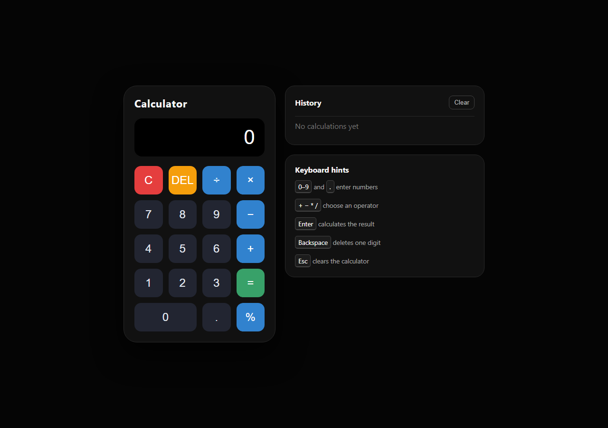

# Calculator

Level 2, Task 1 of the Oasis Infobyte Web Development and Designing internship.

## Overview

This browser-based calculator performs basic arithmetic through a responsive,
button-driven interface. Its calculation logic is written in vanilla JavaScript
without using `eval()`.

## Features

- Addition, subtraction, multiplication, and division
- Decimal number input
- Chained calculations
- Clear and backspace controls
- Division-by-zero error handling
- Percentage calculation
- On-screen calculation history with a separate clear button
- Visible keyboard shortcut hints
- Mouse and keyboard input
- Accessible labels and visible keyboard focus

## Technologies

- HTML5
- CSS3 with CSS Grid
- Vanilla JavaScript

## Run locally

Open `index.html` in any modern web browser. No installation or build step is
required.

## Keyboard controls

| Key | Action |
| --- | --- |
| `0`–`9`, `.` | Enter a number |
| `+`, `-`, `*`, `/` | Select an operator |
| `Enter`, `=` | Calculate |
| `Backspace`, `Delete` | Remove the last character |
| `Escape`, `C` | Clear |
