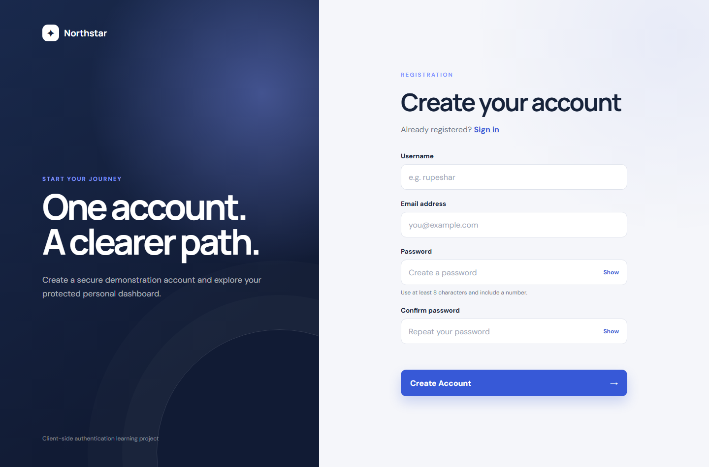
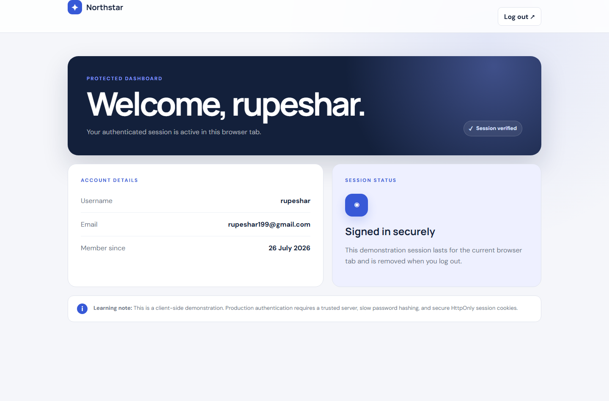
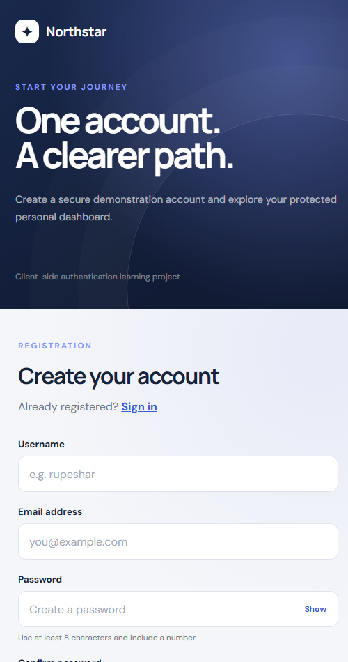

# Northstar — Login Authentication System

Level 2, Task 4 of the Oasis Infobyte Web Development and Designing internship.

## Overview

Northstar is a front-end authentication demonstration built with HTML, CSS, and
vanilla JavaScript. It includes registration, login validation, a protected
dashboard, logout, duplicate-account checks, and salted SHA-256 password hashes.







## Features

- Separate registration and login pages
- Username and email duplicate detection
- Minimum eight-character password with a required number
- Password confirmation
- Salted SHA-256 password hashing through the Web Crypto API
- Generic incorrect-credential error
- Protected dashboard with direct-access redirection
- Tab-scoped authenticated session using `sessionStorage`
- Logout and session clearing
- Responsive layout and accessible form labels

## Storage approach

- Registered account records are stored in `localStorage`.
- Each password receives a random salt and is saved only as a SHA-256 hash.
- The current user ID is stored in `sessionStorage` for the browser tab.

## Important security note

This project demonstrates authentication concepts entirely in the browser. It
is not suitable for real accounts or sensitive data because users can inspect
and modify client-side storage and JavaScript. Production authentication should
use a trusted server, a slow password hashing algorithm such as Argon2 or
bcrypt, and secure HttpOnly session cookies.

## Run locally

The Web Crypto and storage APIs require a suitable browser origin. Use the live
GitHub Pages deployment or run a local HTTP server:

```bash
python -m http.server 8000
```

Then open:

`http://localhost:8000/WebDev-L2-LoginAuthenticationSystem/`

## References

- [MDN — SubtleCrypto.digest()](https://developer.mozilla.org/en-US/docs/Web/API/SubtleCrypto/digest)
- [MDN — sessionStorage](https://developer.mozilla.org/en-US/docs/Web/API/Window/sessionStorage)
- [MDN — Session management](https://developer.mozilla.org/en-US/docs/Web/Security/Authentication/Session_management)
