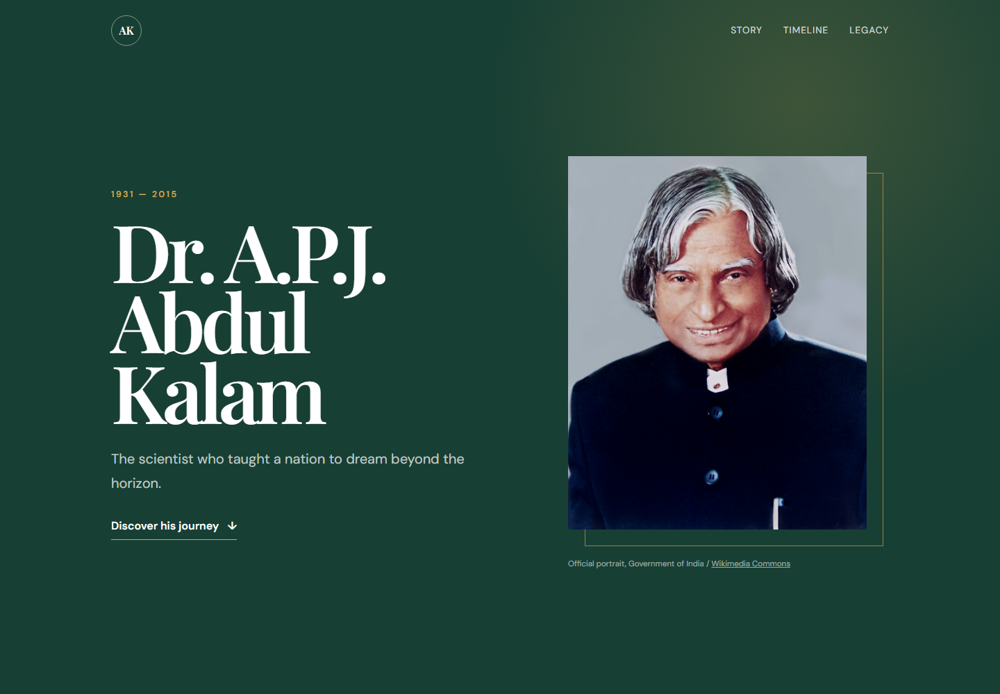
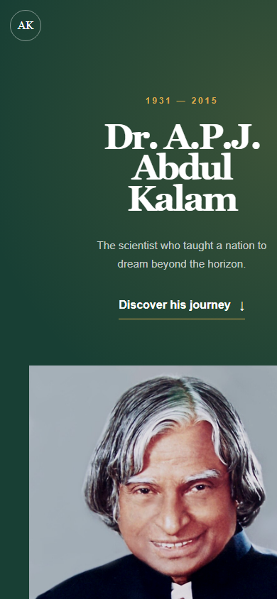

# Tribute Page — Dr. A.P.J. Abdul Kalam

Level 2, Task 2 of the Oasis Infobyte Web Development and Designing internship.

## Overview

A responsive tribute page celebrating Dr. A.P.J. Abdul Kalam's journey as an
aerospace scientist, President of India, author, and teacher.

## Features

- Full-screen introductory section with a prominent portrait
- Four-paragraph original biography
- Six-event achievements timeline
- Distinct quote section
- Responsive desktop and mobile layouts
- Serif display type paired with a sans-serif body font
- Accessible navigation and descriptive image text

## Technologies

- HTML5
- CSS3
- CSS Grid and Flexbox

## Run locally

Open `index.html` in a modern web browser. No dependencies or build process are
required.

## Sources and image credit

- Biographical research: [President of India — Dr. A.P.J. Abdul Kalam](https://www.presidentofindia.gov.in/dr-apj-abdul-kalam-profile)
- Quote source: [President of India — Address to Students](https://www.presidentofindia.gov.in/dr-apj-abdul-kalam/speeches/address-students)
- Portrait: Government of India, via [Wikimedia Commons](https://commons.wikimedia.org/wiki/File:A._P._J._Abdul_Kalam.jpg), licensed under the Government Open Data License — India.

The biographical text in this project was written originally from the cited
research and was not copied from the source pages.
