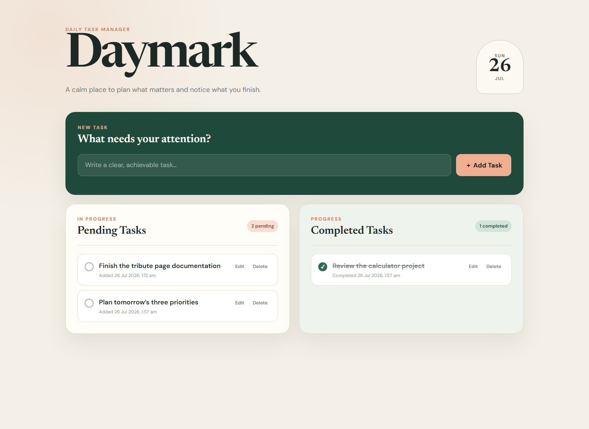
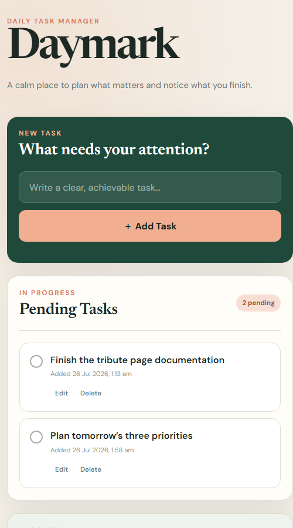

# Daymark — To-Do Web App

Level 2, Task 3 of the Oasis Infobyte Web Development and Designing internship.

## Overview

Daymark is a responsive daily task manager built with HTML, CSS, and vanilla
JavaScript. It separates pending and completed work while keeping every task
available after a page refresh.





## Features

- Add tasks to a pending list
- Mark tasks complete or move them back to pending
- Edit task text inline with Save and Cancel controls
- Delete tasks from either list
- Live pending and completed task counts
- Friendly empty states
- Added and completed timestamps
- Persistent browser storage with `localStorage`
- Responsive desktop and mobile layouts

## Technologies

- HTML5
- CSS3
- Vanilla JavaScript
- Web Storage API

## Run locally

For reliable `localStorage` behavior, run the project through a local web server
or use the deployed GitHub Pages URL instead of opening it with a `file:` URL.

With Python installed:

```bash
python -m http.server 8000
```

Then open `http://localhost:8000/WebDev-L2-ToDoApp/`.

## Learning references

- [MDN — Web Storage API](https://developer.mozilla.org/en-US/docs/Web/API/Web_Storage_API)
- [MDN — Window.localStorage](https://developer.mozilla.org/en-US/docs/Web/API/Window/localStorage)
- [MDN — Crypto.randomUUID()](https://developer.mozilla.org/en-US/docs/Web/API/Crypto/randomUUID)
